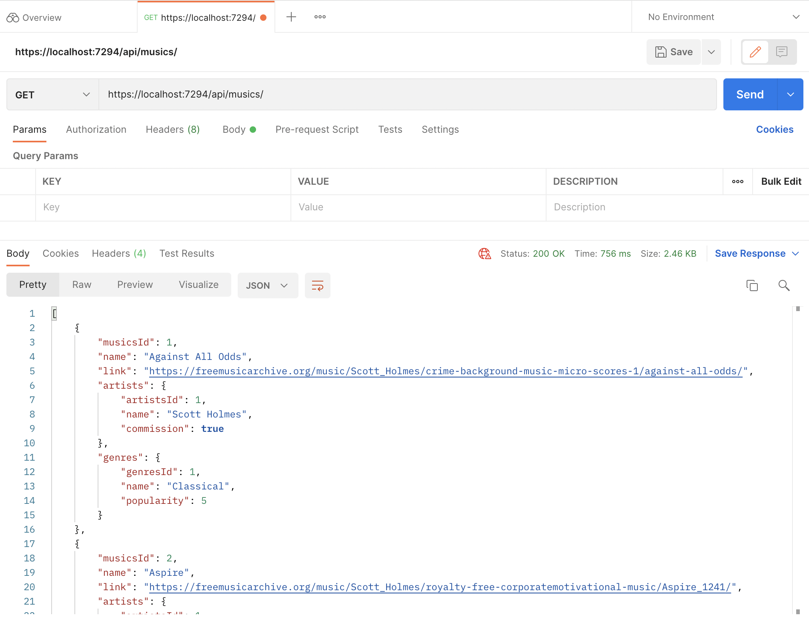
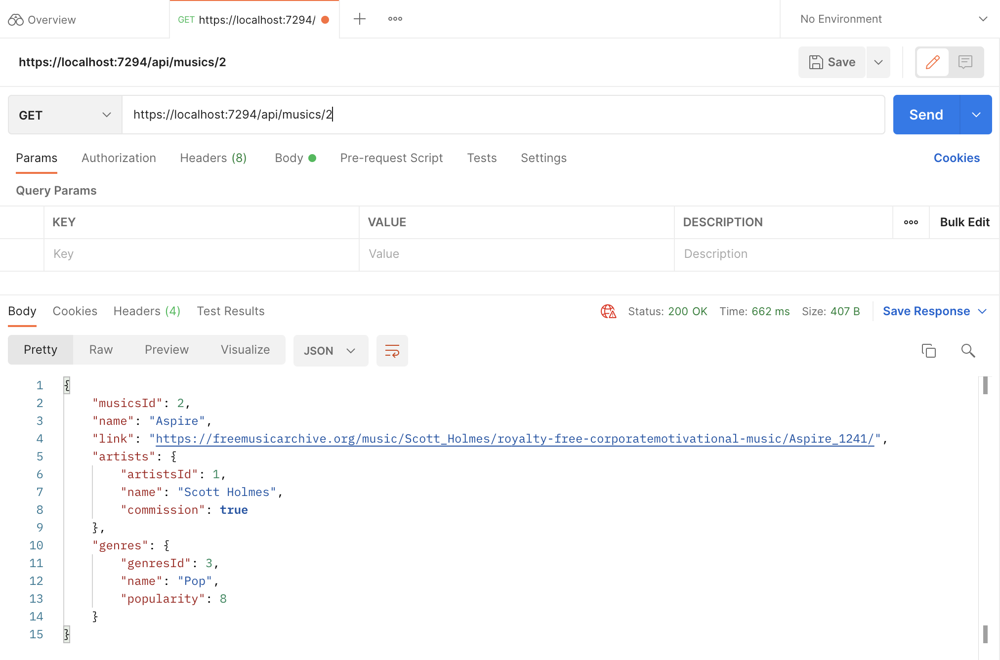
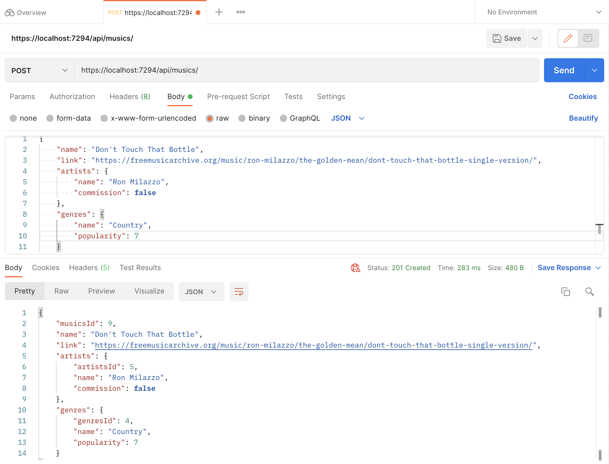
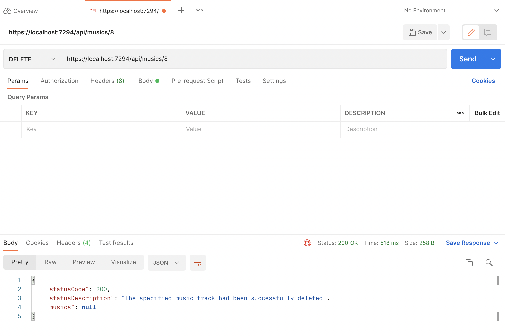

# Copyright Free Music API
Copyright Free Music API is a tool that allows content creaters to find copyright free music that they could use for their content.

This API documents the name of a track, a link to its record, the artist that created it, and the genre it belongs in. It aims to create an accessible tool for people to search for music without ambiguity on the its origin and permissions. 

## Endpoints
This section will showcase different endpoints the API have and their functionality
- (GET) ```https://localhost:7294/api/musics/```
    - Fetches all the music tracks within the API
- Sample Response Body


- (GET) ```https://localhost:7294/api/musics/{id}```
    - Fetches the music track corresponding to the id specified 
- Sample Response Body


- (POST) ```https://localhost:7294/api/musics/```
    - Adds the specified music track to the API
- Sample Request Body 
    ```
        {
            "name": "Don't Touch That Bottle",
            "link": "https://freemusicarchive.org/music/ron-milazzo/the-golden-mean/dont-touch-that-bottle-single-version/",
            "artists": {
                "name": "Ron Milazzo",
                "commission": false
            },
            "genres": {
                "name": "Country",
                "popularity": 7
            }
        }
    ```
- Sample Response Body


- (DELETE) ```https://localhost:7294/api/musics/{id}```
    - Delete the music track corresponding to the id specified
- Sample Response Body


